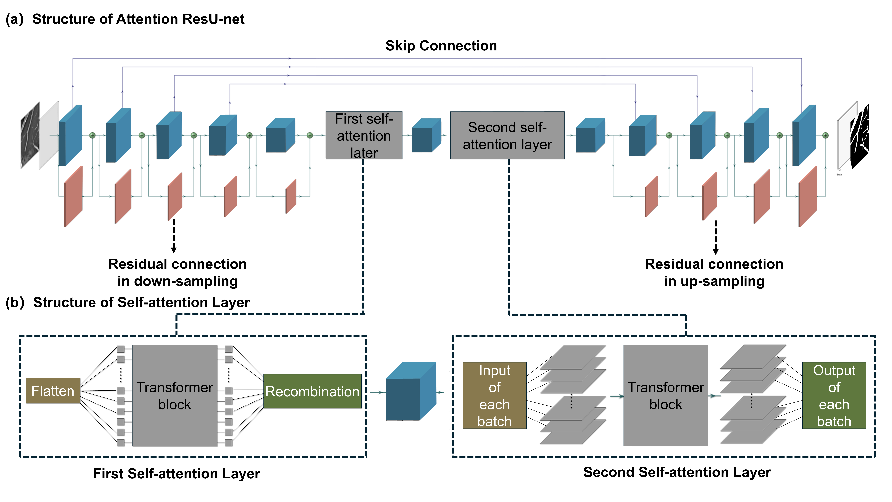
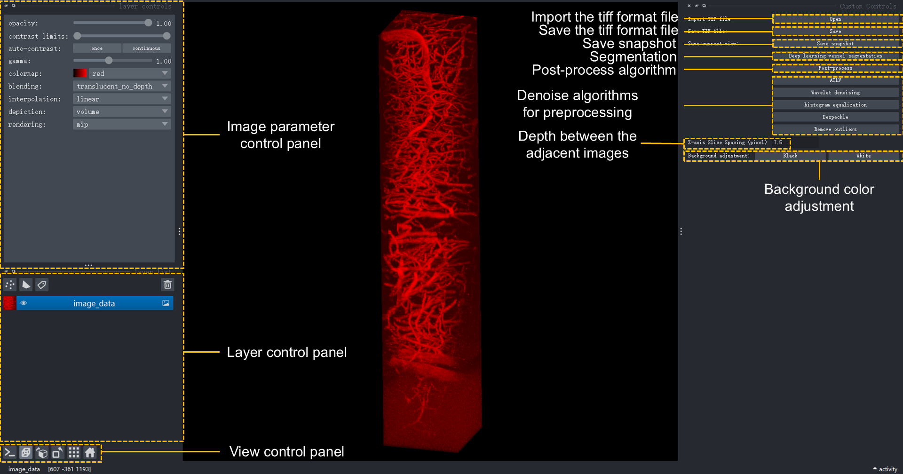

# Multiphoton Fluorescence Vascular Imaging Segmentation Model(MFVISM)

**MFVISM** is a CNN-based model designed with the intention of accurately identifying the positions of blood vessels in multi-photon cerebral vascular imaging and remove background noise. The skeleton of MFVISM is composed of ResU-net and self-attention layers based on transformer.




An overview of the MFVISM pipeline is seen in the image above. Overall Structure consisting of a self-attention layer and residual networks.

1. [Getting Started](#getting-started)
2. [Data](#data)
    1. [Training Datasets](#Training-Datasets)
    2.  [Testing Datasets](#Testing-Datasets)
    3. [Other MPFI Datasets](#Other-MPFI-Datasets)
3. [Training](#Training)
6. [Testing](#Testing)
7. [Front page](#Front-page)


## Getting Started

**This Code and Environment have been trained and tested on Nvidia 5080**

#### Creating Conda Environment

```
conda create --name env python=3.11
```
```
conda activate env
```

#### Install requirements
```
pip install -r requirements.txt
```
## Data
[model's checkpoint](https://drive.google.com/drive/folders/13gKZeLUaaSNgNtVCFUIFgmQHc6fqy2Nv?usp=drive_link)
[Training datasets](https://drive.google.com/drive/folders/1LuE_HMlJGeZ_iseVCi9y0pa_4la0OKW7?usp=drive_link)
[testing datasets](https://drive.google.com/drive/folders/1RoT3sdV248Ij21J42OrjynhlNgNQ93d9?usp=drive_link)
[other_MPFI_datasets](https://drive.google.com/drive/folders/1yyjUIjvh1dhQ6ib16kQVSa1mTdXaQ4_G?usp=drive_link)

### Training Datasets
The training set consists of multi-photon brain microvascular images captured by the AIE-gen probe. These images are stored as a tif format file containing 337 pictures. They have been converted into 337 png format images, and data augmentation such as rotation and inversion has been applied. In total, there are 1348 images used for training.

```
datasets/
├── train
│   ├── ori
│   ├── mask
```

### Testing Datasets
The test set is also a multi-photon brain microvascular image captured by the AIE-gen probe. It is stored as a tif format file containing 380 images, and has also been converted into png format images.
```
val/
├── temp_png
├── Y_mask_test
```

### Other MPFI Datasets

```
Other-MPFI-Datasets/
├── 2200 nm-q655.tiff
├── 2200 nm-q800.tiff
├── icg-gaas-5umstep.tiff
```

## Training
To train a model run:

Basic training
```
python train.py --ResU_net_Transformer --Dice_Loss
```


Enhanced training
```
python train.py --ResU_net_Transformer --cal_metrics --Focal_Loss
```
The path to the training checkpointing resources will be in form of ```model_metrics/net_segmentation.pth```.
## Testing

To test a model run:
```
python test.py --ResU_net_Transformer
```
If you want to skip the training process, you can directly download the checkpoint and save it at the path ```model_metrics/net_segmentation.pth```.
## Front page


To open the front page:

> python main.py
